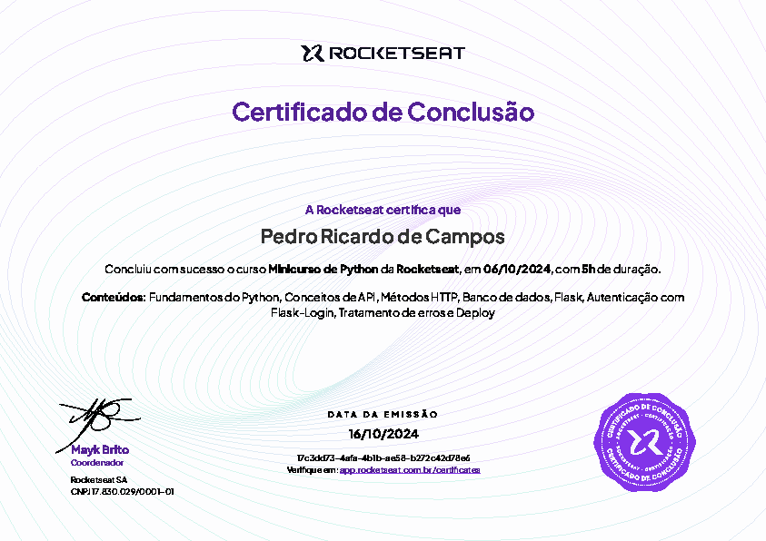

# Mini Curso de Python - Rocketseat

Este repositório contém o material e os exemplos do Mini Curso de Python oferecido pela Rocketseat. O curso tem como objetivo ensinar os fundamentos da linguagem Python, incluindo conceitos de programação, manipulação de dados e criação de aplicações simples através do desenvolvimento de uma API que simula um sistema e-commerce.

## Conteúdo

- Criação de rotas
- Integração ao banco de dados
- Autenticação de usuários
- Listagem de produtos
- Inserção dos itens ao carrinho de comprar
- Checkout dos itens

## Tecnologias Utilizadas

- Python
- Flask
- SQLite
- SQLAlchemy
- Postman (para testes de API)

## Como Executar

### Pré-requisitos
#### Python - Você pode fazer o download [aqui](https://www.python.org/downloads/).
#### Postman - Você também pode fazer o download [aqui](https://www.postman.com/downloads/).

### Instalação

1. Clone este repositório:
   ```bash
   git clone https://github.com/pedrordcampos/Mini-Curso-de-Python---Rocketseat.git
   
2. Navegue até o diretório do projeto
   ```bash
   cd mini-curso-python-rocketseat

3. Crie um ambiente virtual
    ```bash
   python -m venv venv

4. Ative o ambiente virtual
   ```bash
   venv\Scripts\activate
5. Instale as dependências
   ```bash
   pip install -r requirements.txt

6. Para rodar a aplicação
   ```bash
   python app.py

### Dúvidas? Entre em contato
#### Pedro Ricardo de Campos - Whatspp (15) 9952-3275
#### E-mail: pedro.rdcampos@hotmail.com
#### Linkedin: https://www.linkedin.com/in/pedro-ricardo-de-campos/

# 


